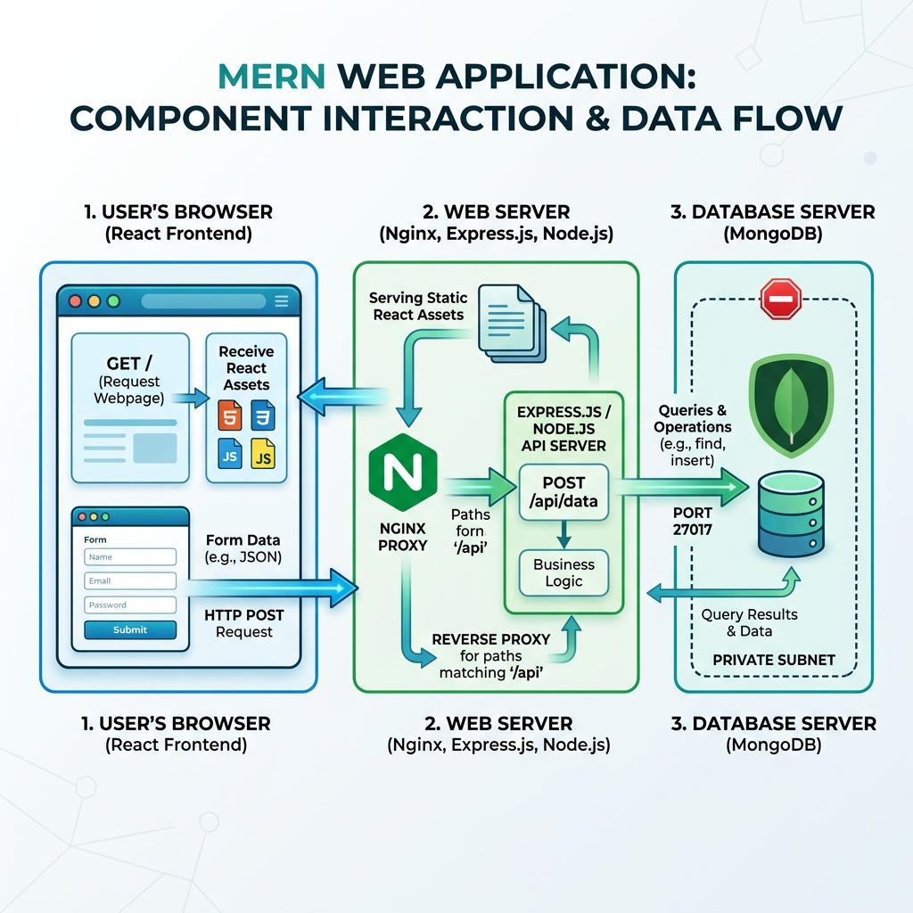

# TravelMemory MERN Stack Deployment on AWS

This project automates the deployment of the **TravelMemory** MERN (MongoDB, Express, React, Node.js) application onto a secure, two-tier AWS infrastructure.

The provisioning is managed using **Terraform**, and the configuration management & application deployment is orchestrated using **Ansible**.

---

## 🏛️ System Architecture (Infographic Format)

The diagram below illustrates the network configuration, security groups, and request flow from the user browser through Nginx, Express, and MongoDB.



### Key Security & Architectural Features:
1. **Network Isolation:** The Database Server is located in a private subnet, preventing direct ingress from the internet. The Web Server is in a public subnet to accept user traffic.
2. **Reverse Proxying:** Nginx acts as a reverse proxy, serving the compiled React static files and forwarding `/api/` calls to the local Node.js backend. This protects the backend from direct exposure and solves Cross-Origin Resource Sharing (CORS) complexities.
3. **SSM Managed Instances:** Instances are associated with an IAM Instance Profile containing the `AmazonSSMManagedInstanceCore` policy, allowing secure administration access via AWS Systems Manager without leaving SSH Port 22 open to the world.
4. **NAT Gateway Routing:** The private database server downloads updates and security patches through the NAT Gateway, while remaining shielded from incoming external connections.

---

## 🚀 Getting Started

This deployment workflow is designed for:
- **Local Control Host:** Windows 11 running Windows Subsystem for Linux (WSL - Ubuntu 20.04/22.04).
- **Remote Target Host:** AWS EC2 instances running Ubuntu 22.04 LTS (AWS Ubuntu).

---

### 💻 Quickstart Setup for Windows 11 WSL (Ubuntu)

If you are developing on Windows 11, open your WSL Ubuntu terminal and run the following command sequence to install **AWS CLI**, **Terraform**, and **Ansible** all together:

```bash
# 1. Update system package index and install basic utilities
sudo apt update && sudo apt install -y curl unzip git software-properties-common

# 2. Download and install the AWS CLI
curl "https://awscli.amazonaws.com/awscli-exe-linux-x86_64.zip" -o "awscliv2.zip"
unzip awscliv2.zip
sudo ./aws/install
rm -rf awscliv2.zip aws/

# 3. Add the HashiCorp repository and install Terraform
wget -O- https://apt.releases.hashicorp.com/gpg | sudo gpg --dearmor -o /usr/share/keyrings/hashicorp-archive-keyring.gpg
echo "deb [signed-by=/usr/share/keyrings/hashicorp-archive-keyring.gpg] https://apt.releases.hashicorp.com $(lsb_release -cs) main" | sudo tee /etc/apt/sources.list.d/hashicorp.list
sudo apt update && sudo apt install -y terraform

# 4. Add the Ansible PPA and install Ansible
sudo add-apt-repository --yes --update ppa:ansible/ansible
sudo apt install -y ansible
```

Once installed, check that all versions are active:
```bash
aws --version
terraform -version
ansible --version
```

---

### Prerequisites & Tool Installation (Individual Platforms)

If you are deploying from a standard host system or wish to install tools individually, use the instructions below:

#### 1. Installing Terraform
*   **Windows (via Chocolatey):**
    ```powershell
    choco install terraform
    ```
    *(Or download the binary from [Terraform Downloads](https://developer.hashicorp.com/terraform/downloads) and add its folder to your system PATH)*
*   **Linux (Ubuntu/Debian):**
    ```bash
    wget -O- https://apt.releases.hashicorp.com/gpg | sudo gpg --dearmor -o /usr/share/keyrings/hashicorp-archive-keyring.gpg
    echo "deb [signed-by=/usr/share/keyrings/hashicorp-archive-keyring.gpg] https://apt.releases.hashicorp.com $(lsb_release -cs) main" | sudo tee /etc/apt/sources.list.d/hashicorp.list
    sudo apt update && sudo apt install terraform
    ```

#### 2. Installing Ansible
> [!IMPORTANT]
> **Windows Users:** Ansible does not support running natively on Windows to manage other systems. You **must** use Windows Subsystem for Linux (WSL) to run Ansible playbooks.
*   **Windows (via WSL Ubuntu):**
    1. Install WSL (Ubuntu) by running in PowerShell as Administrator:
       ```powershell
       wsl --install
       ```
       *(Restart your machine if prompted)*
    2. Open your WSL Ubuntu terminal and run the following commands to install Ansible:
       ```bash
       sudo apt update
       sudo apt install -y software-properties-common
       sudo add-apt-repository --yes --update ppa:ansible/ansible
       sudo apt install -y ansible
       ```
*   **Linux (Ubuntu/Debian):**
    ```bash
    sudo apt update
    sudo apt install -y software-properties-common
    sudo add-apt-repository --yes --update ppa:ansible/ansible
    sudo apt install -y ansible
    ```

#### 3. Installing AWS CLI
*   **Windows:** Download and run the [AWS CLI MSI installer](https://awscli.amazonaws.com/AWSCLIV2.msi).
*   **Linux:**
    ```bash
    curl "https://awscli.amazonaws.com/awscli-exe-linux-x86_64.zip" -o "awscliv2.zip"
    unzip awscliv2.zip
    sudo ./aws/install
    ```

---

### AWS Configuration Steps

#### 1. AWS Account & IAM User Configuration
1. Sign in to the [AWS Management Console](https://aws.amazon.com/).
2. Open the **IAM (Identity and Access Management)** dashboard.
3. Navigate to **Users** and click **Create User**.
4. Set a user name (e.g., `travelmemory-deployer`).
5. Under **Permissions options**, select **Attach policies directly** and attach the **AdministratorAccess** managed policy (needed for VPC, EC2, NAT Gateway, Security Group, and IAM Profile management).
6. Click **Create User**.
7. Select the newly created user, click the **Security credentials** tab, scroll down to **Access keys**, and click **Create access key**.
8. Select **Command Line Interface (CLI)** as the use case, check the confirmation, and click **Next** and **Create access key**.
9. **Crucial:** Download the `.csv` file containing your **Access Key ID** and **Secret Access Key**. Store them securely.

#### 2. Local AWS CLI Authentication
1. Install the [AWS CLI](https://aws.amazon.com/cli/) on your local machine.
2. Open a terminal (Git Bash, WSL, or Command Prompt) and run:
   ```bash
   aws configure
   ```
3. Enter the parameters when prompted:
   *   **AWS Access Key ID:** *[Paste your Access Key ID]*
   *   **AWS Secret Access Key:** *[Paste your Secret Access Key]*
   *   **Default region name:** `us-east-1` (or your preferred region)
   *   **Default output format:** `json`
4. Test the authentication by querying AWS S3:
   ```bash
   aws s3 ls
   ```

#### 3. SSH Key Pair Generation
You need local SSH credentials to establish secure connections with the instances:
1. Open a terminal and run the key-generator command:
   ```bash
   ssh-keygen -t rsa -b 4096 -f ~/.ssh/id_rsa
   ```
2. Press Enter to skip the passphrase.
3. This creates:
   *   Private Key: `~/.ssh/id_rsa` (configured in Ansible)
   *   Public Key: `~/.ssh/id_rsa.pub` (uploaded to AWS via Terraform)
4. Copy the public key text to paste into `terraform.tfvars`:
   ```bash
   cat ~/.ssh/id_rsa.pub
   ```

---

## 🛠️ Step 1: Provision Infrastructure with Terraform

1. Open your terminal and navigate to the `terraform/` directory:
   ```bash
   cd terraform
   ```

2. Initialize the Terraform backend and provider plugins:
   ```bash
   terraform init
   ```

3. Open `terraform.tfvars` and customize your configuration. Specifically, provide your SSH public key content and specify your local public IP for SSH ingress:
   ```hcl
   project_name   = "travelmemory"
   aws_region     = "us-east-1"
   allowed_ssh_ip = "YOUR_PUBLIC_IP/32" # Restricts SSH access to your IP only
   ssh_public_key = "ssh-rsa AAAAB3NzaC..." # Paste your actual public key content here
   ```

4. Preview the resources Terraform plans to create:
   ```bash
   terraform plan
   ```

5. Provision the infrastructure on AWS:
   ```bash
   terraform apply
   ```
   *(Review the resources and type `yes` when prompted)*

6. **Save the Outputs:** Once complete, Terraform will print outputs similar to:
   ```text
   web_server_public_ip = "54.210.35.42"
   web_server_public_dns = "ec2-54-210-35-42.compute-1.amazonaws.com"
   db_server_private_ip = "10.0.2.247"
   ```

---

## 🔧 Step 2: Configure & Deploy with Ansible

With the servers provisioned, use Ansible to configure MongoDB, install Node.js/NPM, and deploy the application.

1. Navigate to the `ansible/` directory:
   ```bash
   cd ../ansible
   ```

2. Update `inventory.ini` with the IPs output by Terraform:
   - Put the `web_server_public_ip` in the `[web]` group.
   - Put the `db_server_private_ip` in the `[db]` group.

   Example `inventory.ini`:
   ```ini
   [web]
   webserver ansible_host=54.210.35.42 ansible_user=ubuntu

   [db]
   dbserver ansible_host=10.0.2.247 ansible_user=ubuntu

   [db:vars]
   ansible_ssh_common_args='-o ProxyCommand="ssh -W %h:%p -q -o StrictHostKeyChecking=no ubuntu@54.210.35.42"'
   ```

3. Ensure your local SSH private key matches the public key uploaded to AWS, and update the `private_key_file` path in `ansible.cfg` if needed:
   ```ini
   private_key_file = ~/.ssh/id_rsa
   ```

4. Verify communication with your EC2 servers:
   ```bash
   ansible all -m ping
   ```

5. Run the master deployment playbook:
   ```bash
   ansible-playbook site.yml
   ```

---

## 🔍 Step 3: Verification

1. After Ansible completes, open your web browser.
2. Navigate to the public IP of your Web Server:
   `http://<web_server_public_ip>/` (e.g., `http://54.210.35.42/`).
3. Add a few travel entries (trips) to verify the React frontend successfully communicates with the Node.js backend and writes the records to the MongoDB database.
